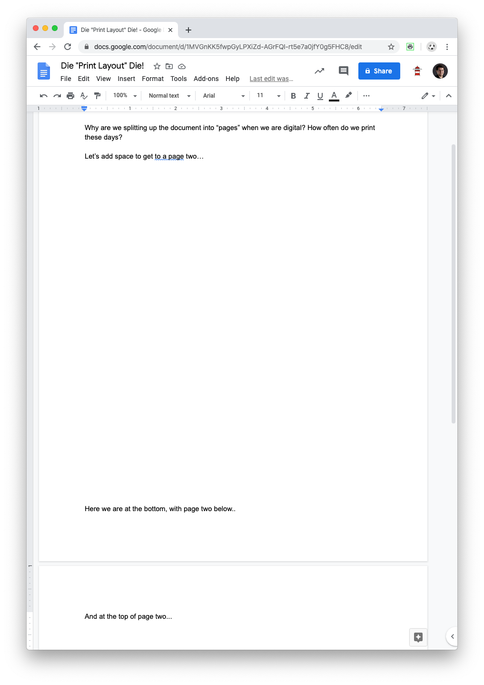

# Die Print Layout Die!

This is a Chrome Extension to default Google Docs to turn off the "Print Layout" view and page break when loading a document.

If you click on the extension icon, it will toggle between green (on) and red (off).

When off, when you load documents it won't force "Print Layout" off and kill the page break UI "---".

When on, it will!

After a toggle, reload the page if needed.

## Why do you need this?

So, I admit to having some OCD. This causes me to be quite anal when it comes to how I like my UI. Fortuntely, the Web offers the escape hatch of extensions (yay!).

I rarely print documents, and thus the notion of "pages" is quaint. Google Docs tends to nudge a print layout, with a visual page break. I don't want these on, so this extension gets them off for me.

What do I mean? Here's the visuals:

### Google Docs with Print Layout On

### Google Docs with Print Layout Off, but the page break visable

### Google Docs with Print Layout Off, and no page break (what this extension does!)

## Anything else I should know?

- This currently runs on load, which lets you make changes after the fact vs. polling and always forcing it off
- If you want to toggle it off, just click on the badge icon until it's red and reload the page
- If you aren't seeing results on an internal site or see an error `"This page cannot be scripted due to an ExtensionsSettings policy."` it means that your organization is limiting content scripts (often on internal content). To fix this, you need to add a `key: $TOKEN_FROM_YOUR_ORGANIZATION` to the `manifest.json`
