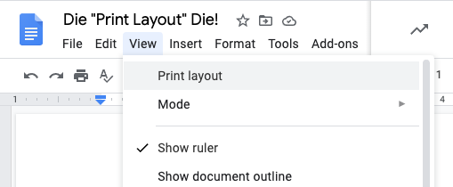

# Die Print Layout Die!

This is a Chrome Extension to default Google Docs to turn off the "Print Layout" view and page break when loading a document.

If you click on the extension icon, it will toggle between green (on) and red (off).

When off, when you load documents it won't force "Print Layout" off and kill the page break UI "---".

When on, it will!

After a toggle, reload the page if needed.
